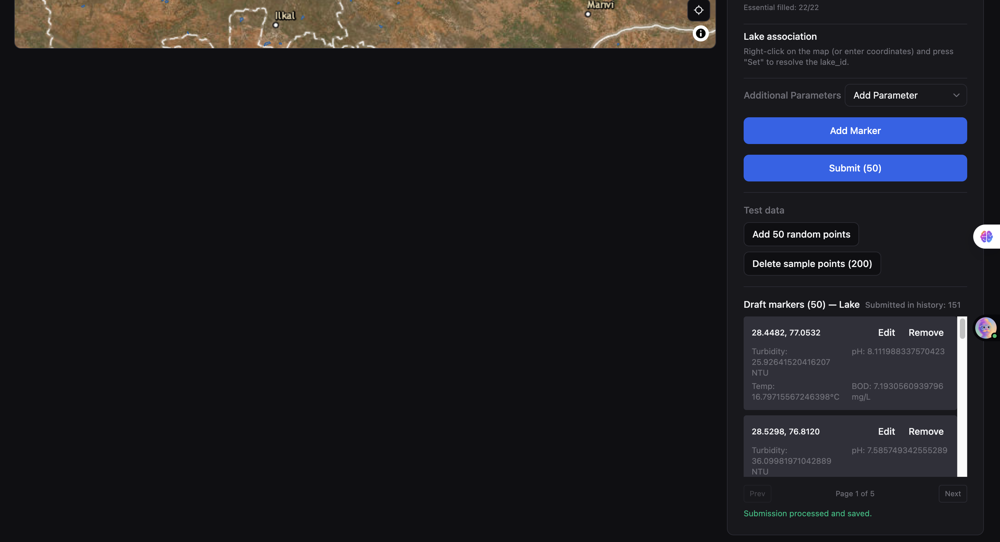
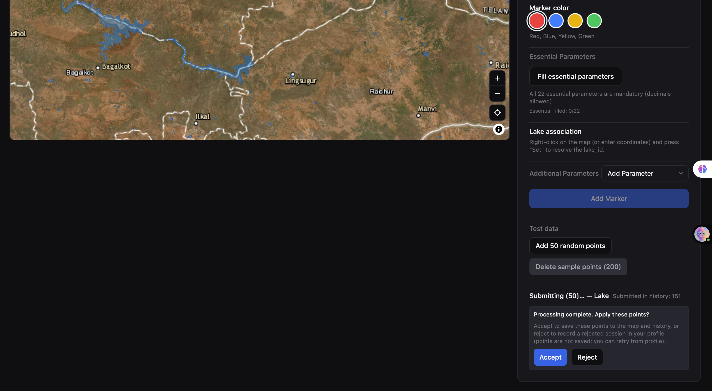

# Varuna Drishti
 
## Project Objective
 
Develop a web-based geospatial water quality monitoring platform that allows users to add sampling markers, inspect historical point data, compare submitted and added points, and analyze water quality trends across different water bodies such as lakes, rivers, and ponds.
 
The platform supports:
- Interactive map-based point creation and inspection
- Water quality parameter entry such as turbidity, pH, temperature, and BOD
- Point history and latest-state visualization
- Charts for trend analysis
- A clear separation between submitted data and live/added map points
 
Team Members:
- Hardik Bansal (230001031)
- Param Saxena (230001060)
- Keshav Singhal (230001039)
- Thikmanik (230001077)
- Ashrith Reddy (230001043)
 
---
 
## Setup Instructions
 
### 1. Prerequisites
Make sure the following are installed:
 
- Node.js (v16 or above)
- npm
- A modern browser such as Chrome, Edge, or Firefox
- Clone the Repo or install as zip
 
### 2. Install Dependencies
 
Navigate to the root directory of the project folder, then run:
 
#### Windows (Command Prompt / PowerShell)
```cmd
cd path\to\project
npm install
```
 
#### macOS / Linux
```bash
cd path/to/project
npm install
```
 
### 3. Run the Project
 
#### Windows (Command Prompt / PowerShell)
```cmd
npm run dev
```
 
#### macOS / Linux
```bash
npm run dev
```
 
### 4. Open in Browser
Open the local development URL shown in the terminal, usually:
 
```
http://localhost:5173
```
 
---
 
## Platform-Specific Notes
 
### Windows
- Use **Command Prompt**, **PowerShell**, or **Windows Terminal**.
- If `npm` is not recognized, ensure Node.js is added to your system PATH during installation (check *"Add to PATH"* in the Node.js installer).
- To verify installation:
  ```cmd
  node -v
  npm -v
  ```
 
### macOS
- Use the built-in **Terminal** app or a third-party terminal such as iTerm2.
- Node.js can be installed via [nodejs.org](https://nodejs.org) or using [Homebrew](https://brew.sh):
  ```bash
  brew install node
  ```
- To verify installation:
  ```bash
  node -v
  npm -v
  ```
 
### Linux
- Use your distribution's default terminal.
- Install Node.js via your package manager. For Ubuntu/Debian:
  ```bash
  sudo apt update
  sudo apt install nodejs npm
  ```
  For Fedora/RHEL:
  ```bash
  sudo dnf install nodejs npm
  ```
  Or use [nvm (Node Version Manager)](https://github.com/nvm-sh/nvm) for any distro:
  ```bash
  curl -o- https://raw.githubusercontent.com/nvm-sh/nvm/v0.39.7/install.sh | bash
  nvm install 18
  ```
- To verify installation:
  ```bash
  node -v
  npm -v
  ```
 
---

## NOTE
-- TO TEST THE FUNCTIONALITY USE THE ADD RANDOM 50 POINTS BUTTON AS THIS REPO IS NOT CONNECTED TO BACKEND SERVER OR THE WATER BODIES SHAPEFILE SERVER SO WATER BODY ID RESOLUTION WILL FAIL AND LAKE WATER BODY HAS BEEN PROVIDED ALL THE FUNCTIONALITY FOR NOW SO CAN BE TESTED EXTENSIVELY KEEPING THE ABOVE THINGS IN MIND.

## Screenshots

### 1. Main Interface / Add Marker View
This view shows the map, marker color selection, water quality input fields, and marker creation controls.


### 2. Submit Marker
Assuming you used Add 50 random points press SUBMIT(50) Button.



### 3. Accept/Reject to update Marker Points
-- Assuming following above workflow you can now Accept/Reject the Submitted Markers which will not be the functionality available to user but for DEMONSTRATION PURPOSES is provided for now.

-- IF Accept then the submitted markers will be displayed on the Map and will be visible as Accept in the User History and can be explored by selecting the Submission session -> lake id -> the Point.

-- IF Reject the markers will not be displayed on the Map and will be seen as Reject for the corresponding Submission Session and You can click that session to edit makers in those session if any error was there and SUBMIT again.



### 4. Point History Panel
This view shows the selected point’s latest submitted record and its timestamped history.


### 5. Charts / Trend View
This view shows the WQI trend chart for a selected year.


### 6. Profile View
This view shows profile section and accepted/rejected sessions.


### 7. Dashboard / Submitted vs Added Points
This view shows the full dashboard with the map, sidebar controls, and the distinction between live added points and submitted points.


---

## Project Overview

The application is designed to help users monitor water quality in a simple and visual way. A user can click or right-click on the map, enter coordinates manually, select a marker color, and fill in water quality parameters. After submission, the point is stored with metadata such as timestamp, location, and parameter values.

### Key Features
- Add sampling points on an interactive map
- Resolve lake or water-body association from coordinates(if Shapefile server and backend server connected)
- View point history for any selected marker
- Display the latest data for a point
- Show WQI trend charts by year
- Support different marker states and colors
- Separate added points from submitted points for better clarity

---

## Workflow Summary

1. The user selects a location on the map or enters latitude and longitude manually.
2. The user fills in water quality values such as turbidity, pH, temperature, and BOD.
3. The system associates the point with the selected water body.
4. The marker is added to the map and can later be submitted.
5. Historical records for the point are shown in the point history panel.
6. The charts view displays trends for WQI and other measurements over time.

---

## Functional Highlights

### Map and Marker Management
- Add markers for specific lake, river, or pond locations
- Different marker colors can be used to represent categories or status
- Existing points can be viewed directly on the map

### History and Analytics
- Each point can show its history panel
- Submitted data is stored with timestamps
- WQI charts help compare quality changes across months

### Data Differentiation
- **Added Points**: points that are placed on the map
- **Submitted Points**: points that have been finalized and stored as records

This separation makes the interface easier to understand during testing and data review.

---

## Requirements Covered

This project follows the requirements described in the SRS, including:
- Interactive geospatial data entry
- Water quality parameter capture
- Historical point tracking
- WQI trend visualization
- Support for lakes, rivers, and ponds
- Clear UI for monitoring and reporting

---

## Future Scope

- User authentication and role-based access
- CSV or GeoJSON bulk upload
- Advanced filtering and search
- Export to report formats
- Integration with backend APIs for live data synchronization

---

