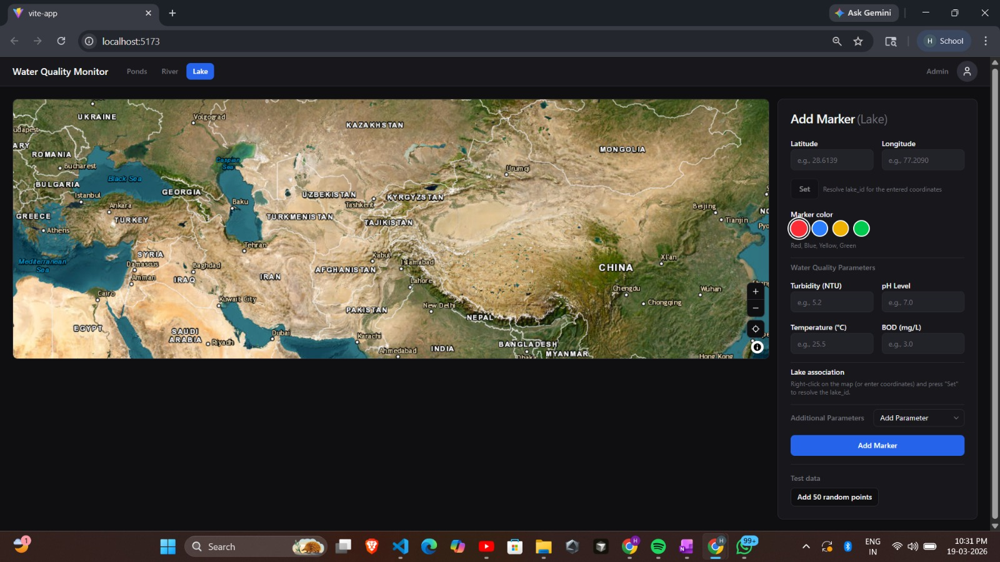
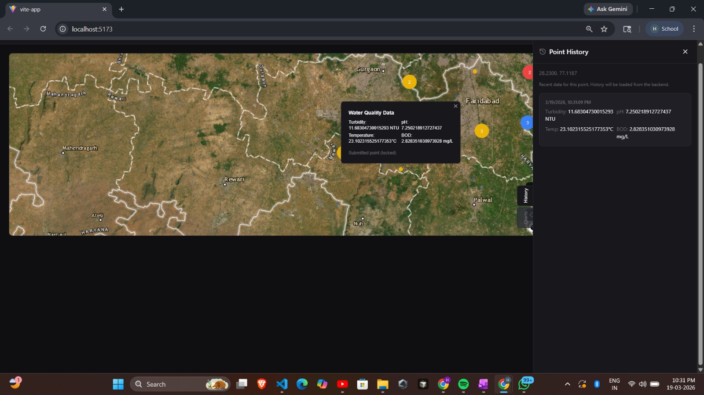
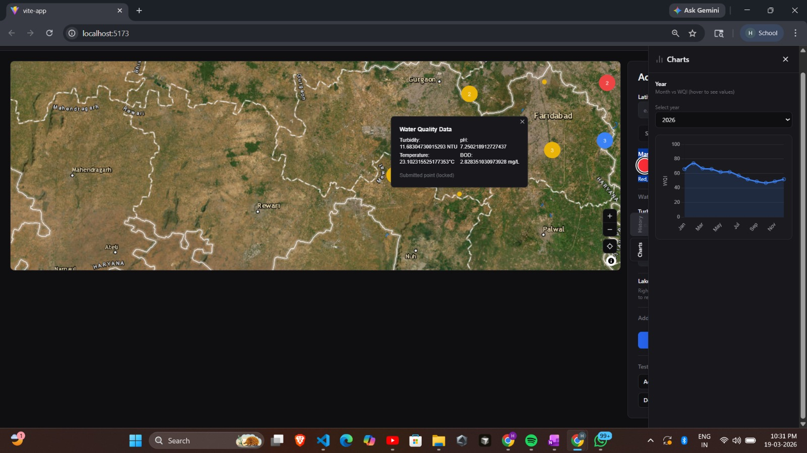
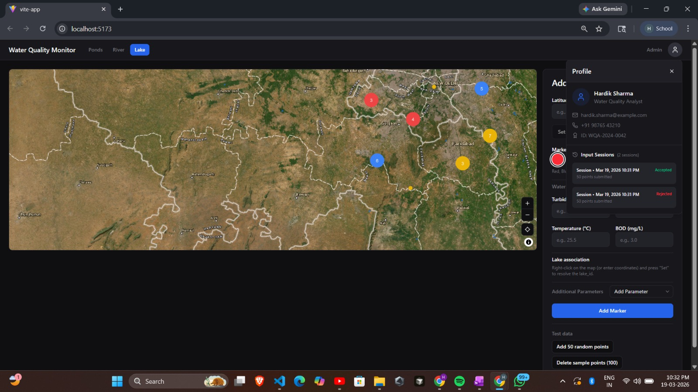
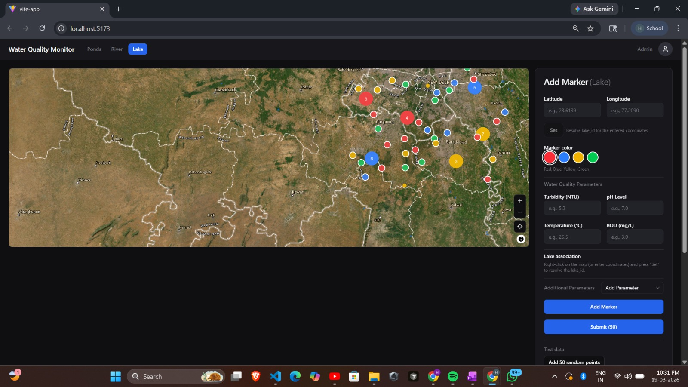

# Water Quality Monitor

## Project Objective

Develop a web-based geospatial water quality monitoring platform that allows users to add sampling markers, inspect historical point data, compare submitted and added points, and analyze water quality trends across different water bodies such as lakes, rivers, and ponds.

The platform supports:
- Interactive map-based point creation and inspection
- Water quality parameter entry such as turbidity, pH, temperature, and BOD
- Point history and latest-state visualization
- Charts for trend analysis
- A clear separation between submitted data and live/added map points

Team Members:
- Varuna Drishti Team

---

## Setup Instructions

### 1. Prerequisites
Make sure the following are installed:

- Node.js (v16 or above)
- npm
- A modern browser such as Chrome, Edge, or Firefox
- Map service/API keys if your project uses any external map provider
- Backend/database connection details if the app is connected to a server

### 2. Install Dependencies
```bash
npm install
```

### 3. Run the Project
```bash
npm run dev
```

### 4. Open in Browser
Open the local development URL shown in the terminal, usually:

```bash
http://localhost:5173
```

---

## Screenshots

### 1. Main Interface / Add Marker View
This view shows the map, marker color selection, water quality input fields, and marker creation controls.



### 2. Point History Panel
This view shows the selected point’s latest submitted record and its timestamped history.



### 3. Charts / Trend View
This view shows the WQI trend chart for a selected year.



### 4. Multiple Markers on Map
This view shows profile section and accepted/rejected sessions.



### 5. Dashboard / Submitted vs Added Points
This view shows the full dashboard with the map, sidebar controls, and the distinction between live added points and submitted points.



---

## Project Overview

The application is designed to help users monitor water quality in a simple and visual way. A user can click or right-click on the map, enter coordinates manually, select a marker color, and fill in water quality parameters. After submission, the point is stored with metadata such as timestamp, location, and parameter values.

### Key Features
- Add sampling points on an interactive map
- Resolve lake or water-body association from coordinates
- View point history for any selected marker
- Display the latest data for a point
- Show WQI trend charts by year
- Support different marker states and colors
- Separate added points from submitted points for better clarity

---

## Workflow Summary

1. The user selects a location on the map or enters latitude and longitude manually.
2. The user fills in water quality values such as turbidity, pH, temperature, and BOD.
3. The system associates the point with the selected water body.
4. The marker is added to the map and can later be submitted.
5. Historical records for the point are shown in the point history panel.
6. The charts view displays trends for WQI and other measurements over time.

---

## Functional Highlights

### Map and Marker Management
- Add markers for specific lake, river, or pond locations
- Different marker colors can be used to represent categories or status
- Existing points can be viewed directly on the map

### History and Analytics
- Each point can show its history panel
- Submitted data is stored with timestamps
- WQI charts help compare quality changes across months

### Data Differentiation
- **Added Points**: points that are placed on the map
- **Submitted Points**: points that have been finalized and stored as records

This separation makes the interface easier to understand during testing and data review.

---

## Requirements Covered

This project follows the requirements described in the SRS, including:
- Interactive geospatial data entry
- Water quality parameter capture
- Historical point tracking
- WQI trend visualization
- Support for lakes, rivers, and ponds
- Clear UI for monitoring and reporting

---

## Future Scope

- User authentication and role-based access
- CSV or GeoJSON bulk upload
- Advanced filtering and search
- Export to report formats
- Integration with backend APIs for live data synchronization

---

## Notes

- The screenshots included in this README are taken from the current project interface.
- You can update the image file names if you reorganize the `pictures/` folder.
- If your backend or map provider needs environment variables, add them to a `.env` file and document them here.
